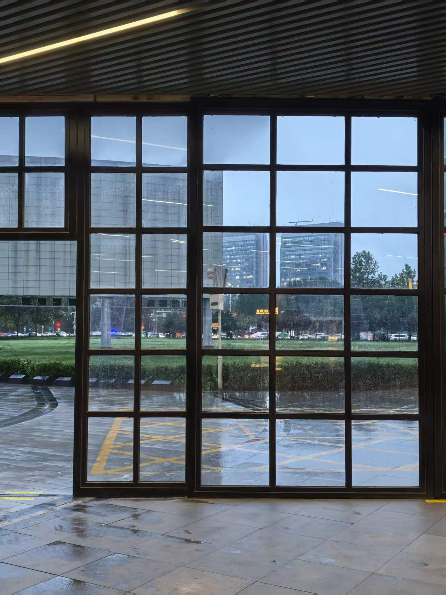
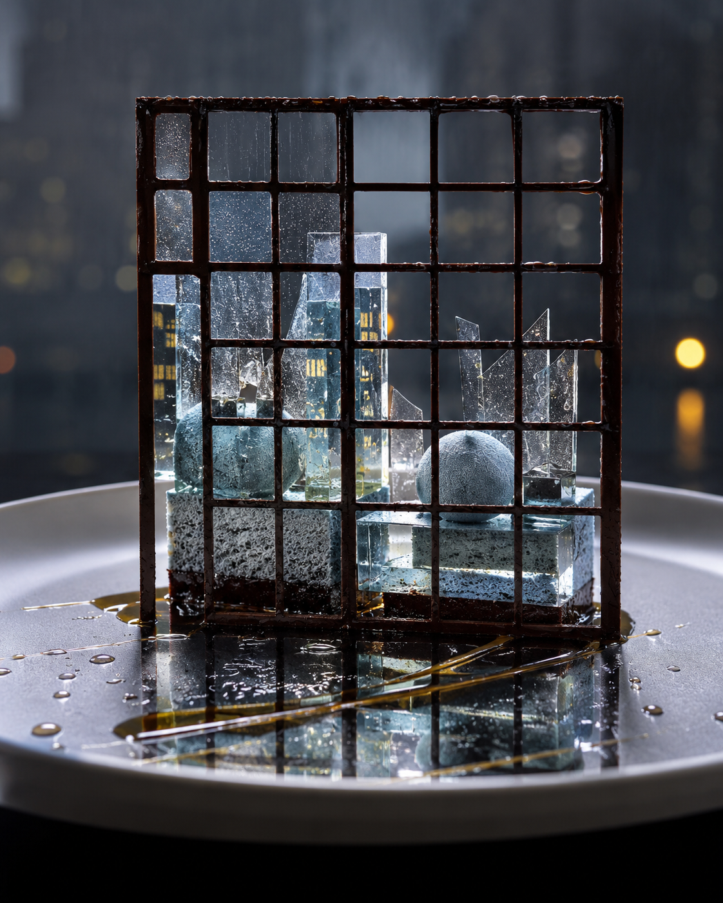
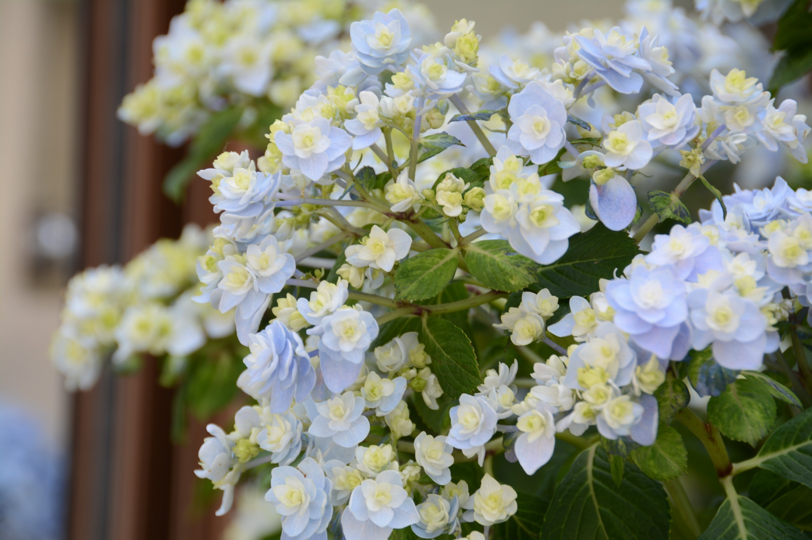
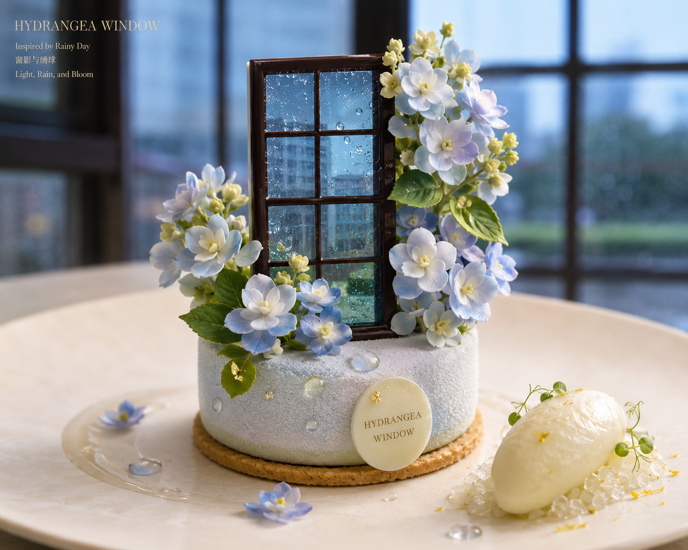
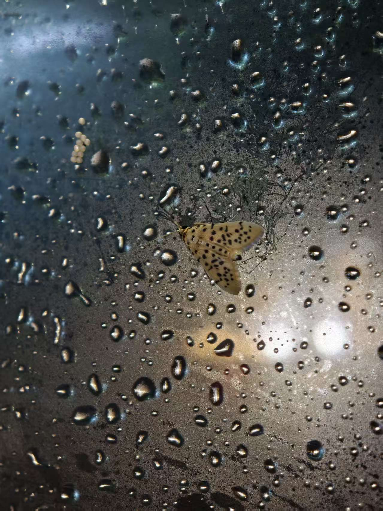
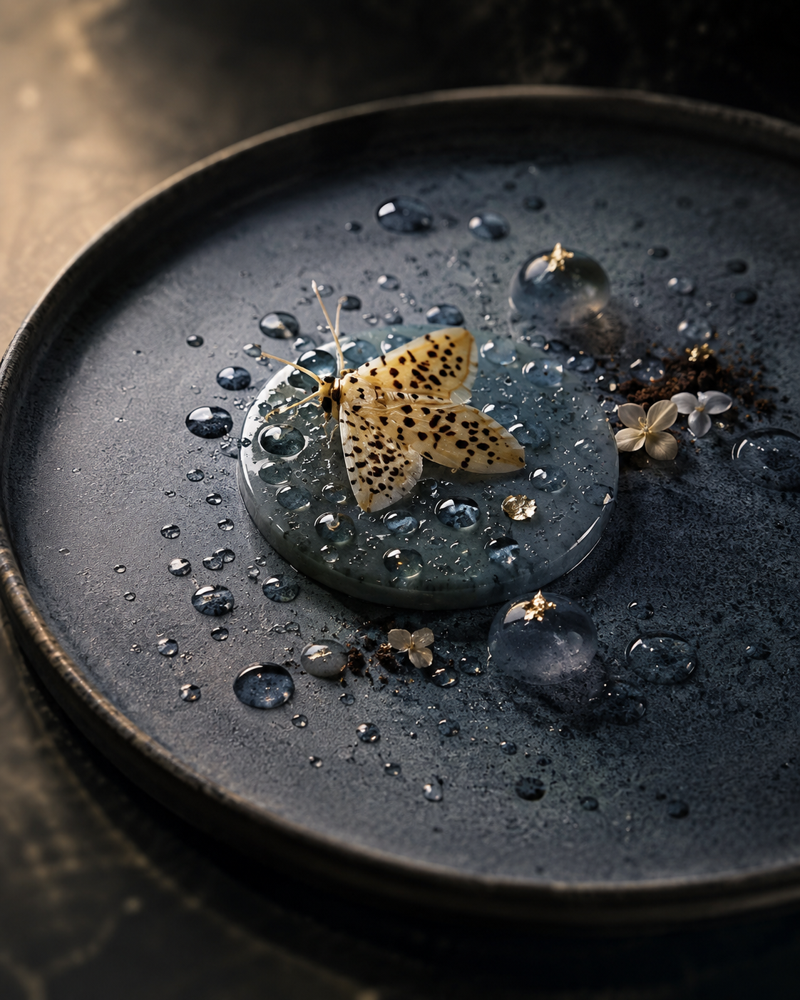
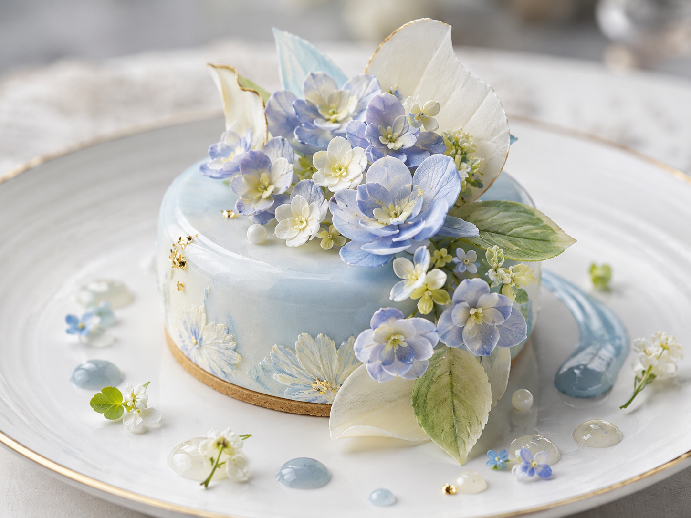

# Visual Examples

These are real source/target pairs produced during development of `$dessert-cutout-from-image`.
Use them to calibrate transformation logic, material realism, source fidelity, and fine-dining art direction.
Do not copy their exact subjects or layouts when the current source image calls for a different solution.

## Example 1 — 01 Rainy Window

Rainy architectural window → chocolate lattice, translucent sugar/glass-like elements, reflective gel, and cool city-rain atmosphere.

**Source**

**Target**

## Example 2 — 02 Hydrangea Window

Pale hydrangea cluster → floral pastry composition with pale blue/ivory palette, botanical garnish, translucent elements, and refined plated styling.

**Source**

**Target**

## Example 3 — 03 Moth Rain Glass

Moth on rainy glass → dark fine-dining plate, translucent gel, raindrop accents, and a delicate edible moth focal element.

**Source**

**Target**

## Example 4 — 04 Hydrangea Entremet

Hydrangea macro → pale-blue modern entremet with edible floral translation, soft green leaf accents, restrained gels, and elegant negative space.

**Source**

**Target**

